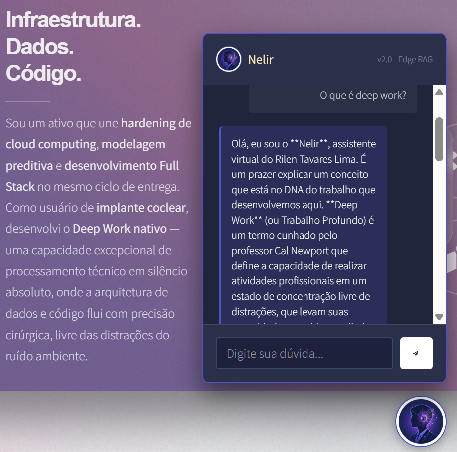

# 🤖 Nelir AI Engine - Atendimento Inteligente no Edge

    
      
    

 

  
  
  
  

 

O **Nelir** (Rilen ao contrário) é um motor de IA conversacional de nível sênior, projetado para atuar como um orquestrador de conhecimento no Edge. Ele não é apenas um chatbot, mas uma implementação de **Serverless AI Architecture** que une processamento de linguagem natural (LLM) com infraestrutura resiliente.

## 🚀 Evolução & Maturidade do Projeto

Este projeto demonstra a transição de uma interface estática para uma solução de **IA Distribuída**:

1.  **V1 - Mock & UX Validation**: Desenvolvimento da interface e fluxo de diálogo inicial.
2.  **V2 - LLM Orchestration**: Implementação da integração nativa com o **Google Gemini 1.5 Flash**.
3.  **V3 - Sênior Edge Infrastructure**: Migração para **Cloudflare Workers**, garantindo latência ultra-baixa e segurança robusta em ambiente de produção.

## 🛠️ Stack Tecnológica & Diferenciais Técnicos

*   **Motor de IA**: `Gemini-Flash-Latest` para respostas rápidas e contexto preciso.
*   **Infrastructure as Code (IaC)**: Configuração via `wrangler.toml`, permitindo deploys reprodutíveis.
*   **Edge Computing**: Execução 100% serverless através do Cloudflare Workers (Runtime V8).
*   **Segurança (CyberSecurity Rooted)**: 
    *   **Secrets Management**: Chaves de API nunca expostas no front-end ou repositório.
    *   **CORS Hardening**: Políticas restritas permitindo chamadas apenas de domínios autorizados.
    *   **Fallback Logic**: Sistema de resiliência que garante atendimento mesmo em falhas de API externa.

## 🧠 Arquitetura de "Deep Work"

O diferencial do Nelir é a sua parametrização (System Prompting) focada na história do seu criador. Através de técnicas de **Personalized AI Positioning**, o bot é capaz de:
*   Articular a experiência de **25 anos de TI** em infraestrutura crítica.
*   Explicar o conceito de **Deep Work nativo** potencializado pelo uso de implante coclear (PcD).
*   Demonstrar expertise em **GNU/Linux**, **Big Data** e **CyberSecurity** de forma contextualizada.

## 🛡️ Desafios de Engenharia Resolvidos (Showcase)

Como um profissional de dados e infra, o projeto resolveu problemas reais de deploy:
*   **Optimization**: Redução do payload de deploy através de `.wranglerignore` estratégico para evitar o erro de `Asset too large`.
*   **Security Incident Response**: Rotação imediata de credenciais de segurança e limpeza de histórico após detecção de vazamento por *Secret Scanning*.
*   **Modularization**: Separação total entre a camada de apresentação (GitHub Pages) e a camada de inteligência (Cloudflare).

---
*Projetado por Rilen Tavares Lima — Transformando 25 anos de infraestrutura sólida em serviços inteligentes e resilientes.*

---
*Desenvolvido por Rilen Tavares Lima — 25 anos transformando infraestrutura em valor.*
